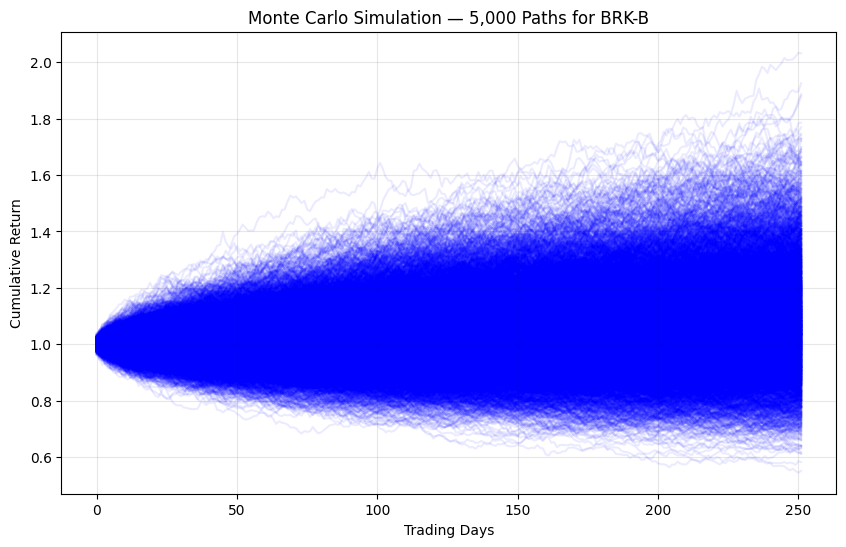

# AI-Powered Quant Trading Agent with Investor Strategy Distillation & Monte Carlo Risk Analysis

**Advanced AI system that distills legendary investors' strategies (Buffett, Dalio, etc.) into actionable trading frameworks, powered by LLM agents, combined with Monte Carlo risk simulation and TradingView integration.**



**Extension of**: [2800.HK ETF Mean-Reversion Framework](https://github.com/Kyle715-hk/hong-kong-index-etf-mean-reversion-framework)

---

## Overview

This project builds an **AI-driven quantitative trading assistant** that:
- Extracts and codifies investment philosophies from legendary investors using LLM-based skill distillation
- Generates structured research notes on stocks using real-time market data
- Integrates with TradingView via Pine Script for visual signals
- Performs Monte Carlo simulations for robust risk and scenario analysis

The goal is to bridge **human investment wisdom** with **modern AI and quantitative techniques** to create more intelligent and risk-aware trading systems.

## Key Features

- **Investor Strategy Distillation** — Converts letters, interviews, and principles from investors (e.g., Warren Buffett, Ray Dalio) into structured JSON (core principles, stock selection criteria, risk rules, and LLM prompt templates)
- **AI Stock Research Agent** — Uses `yfinance` + LLM to generate professional equity research notes with insights, risks, and recommendations
- **Pine Script Integration** — Ready-to-use TradingView indicators (Mean Reversion + Volatility Screener)
- **Monte Carlo Risk Analysis** — Simulates thousands of market paths to evaluate strategy robustness and downside risk
- **OpenRouter + Llama 3.1 Integration** — Leverages powerful open-source LLMs for reasoning and distillation

## Technologies Used

- **Python**: Pandas, NumPy, yfinance
- **AI/LLM**: OpenRouter (Llama 3.1 70B), OpenAI SDK
- **Visualization**: Matplotlib, Seaborn (Monte Carlo paths)
- **Trading**: Pine Script v5
- **Risk**: Monte Carlo Simulation (5,000+ paths)

## Project Structure


## Results Highlights

- Successfully distilled investment philosophies of **Ray Dalio**, **Warren Buffett**, and others into structured, machine-readable formats
- Built functional **AI Stock Research Agent** capable of producing professional-grade research notes
- Generated **Monte Carlo Simulation** with 5,000 paths for BRK-B showing distribution of cumulative returns
- Created TradingView Pine Script for real-time mean-reversion signals on 2800.HK and other tickers

*(Add more specific performance metrics here once you have backtest results)*

## Installation & Setup

```bash
# 1. Clone the repo
git clone https://github.com/Kyle715-hk/AI-Investor-Distillation-Trading-Agent.git
cd AI-Investor-Distillation-Trading-Agent

# 2. Install dependencies
pip install -r requirements.txt

# 3. Add your OpenRouter API key
#    (Create .env file or add to Colab secrets)

---

**Kyle Chan**  
Bachelor of Arts and Sciences in Social Data Science  
The University of Hong Kong  
(+852) 6761 0118 | wangtikchan715@gmail.com  
[LinkedIn](https://linkedin.com/in/wang-tik-chan)

---
